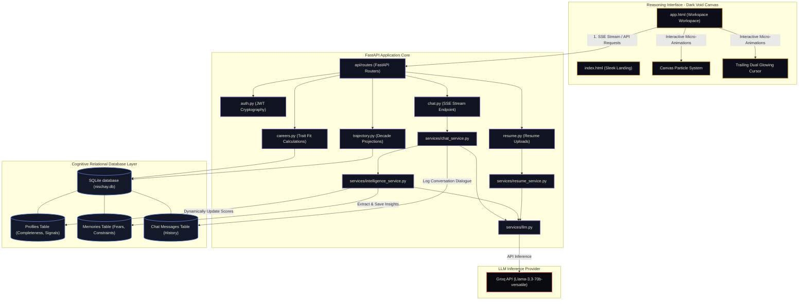

# <p align="center">🔮 Nischay AI</p>
<p align="center">
  <strong>Determined. Adaptive. Autonomous. Cognitive Career Reasoning Platform.</strong>
</p>

<p align="center">
  
  
  
  
  
  
</p>

<hr />

## 🌟 Introduction

**Nischay** (meaning *Determination* or *Resolution* in Sanskrit) is a state-of-the-art career coaching and cognitive reasoning platform. It combines a premium, high-fidelity **Dark Void** frontend interface with a real-time FastAPI intelligence engine powered by LLMs (Groq Llama-3.3-70B). 

Designed for students and young professionals seeking absolute clarity in an uncertain technological landscape, Nischay tracks behavioral signals, measures cognitive drift, processes uploaded resume vectors, and maps long-term career satisfaction trajectories.

---

## 🏗️ Core Architecture Flow

Nischay operates on a dual-engine architecture where the highly animated HTML5/CSS3 client interfaces with the FastAPI core, processing user input through live SQLite storage and LLM inference.



---

## ✨ Features and Technical Showcases

### 🎨 1. Premium Dark-Void Aesthetic & FX
Nischay is engineered around a visually gorgeous design system called **Dark Void** with warm cream accents (`#EDE8DA`) and amber-gold glows (`#C8933C`).
- **Dual Glowing Cursor**: A physics-based custom trailing cursor. It features an interactive inner amber dot and a lagging gold ring that expands over buttons and elements. The native system pointer is hidden globally.
- **SVG Fractal Noise Graining**: Subtly overlayed high-frequency noise textures across background layers, creating a premium physical card look.
- **Canvas Particle Physics**: A custom mathematical coordinate graph built directly on an HTML5 `<canvas>` which connects node clusters dynamically in response to cursor proximity.

### 🧠 2. Psychometric Cognitive Engine & Calculations
As users chat with the AI, the backend extracts psychological signals and updates four critical traits in the SQLite database:
1. **Risk Tolerance (`risk_tolerance`)**
2. **Intrinsic Motivation (`intrinsic_motivation`)**
3. **Analytical Style (`analytical_style`)**
4. **Conscientiousness (`conscientiousness`)**

#### 🧮 Trait Compatibility Formulas
In `api/routes/careers.py`, compatibility fits are dynamically modeled:
*   **B.Tech Computer Science & Engineering**:
    $$\text{Fit} = (0.65 \times \text{Analytical Style}) + (0.35 \times \text{Conscientiousness})$$
*   **Product Management & Entrepreneurship**:
    $$\text{Fit} = (0.55 \times \text{Risk Tolerance}) + (0.45 \times \text{Intrinsic Motivation})$$
*   **Bachelor of Design (B.Des)**:
    $$\text{Fit} = (0.70 \times \text{Intrinsic Motivation}) + (0.30 \times \text{Analytical Style})$$
*   **B.Com + Chartered Accountancy (CA)**:
    $$\text{Fit} = (0.70 \times \text{Conscientiousness}) + (0.30 \times (100 - \text{Risk Tolerance}))$$

#### 📈 10-Year Decadal Outlook
The `api/routes/trajectory.py` route dynamically maps out coordinate data points for ten sequential years:
*   **Income**: $8 + (\text{Year} \times 1.5) \times \frac{\text{Analytical}}{50.0}$
*   **Autonomy**: $4 + (\text{Year} \times 0.4) \times \frac{\text{Risk}}{50.0}$
*   **Burnout**: $20 + (\text{Year} \times 3.5) \times \left(1.5 - \frac{\text{Conscientiousness}}{100.0}\right)$
*   **Satisfaction**: $60 + (\text{Intrinsic} \times 0.3) - (\text{Year} \times 1.5)$

---

## 📂 Project Structure

```bash
Nischay/
├── api/                   # Routing & Middleware Layer
│   ├── dependencies.py    # FastAPI Dependency Injection
│   ├── middleware.py      # Rate Limiting & Log Handlers
│   └── routes/            # Core Route Handlers
│       ├── auth.py        # Token Authentication Endpoints
│       ├── careers.py     # Trait Math & Fits
│       ├── chat.py        # Chat & Streaming Response Ends
│       ├── health.py      # Health System Handlers
│       ├── memory.py      # Constraints Extraction Memory
│       ├── profile.py     # Profile Status Updates
│       ├── resume.py      # PDF parsing & Resume Evaluation
│       └── trajectory.py  # Decadal coordinate math
├── core/                  # Configuration & Global Systems
│   ├── config.py          # Pydantic Settings Validator
│   ├── exceptions.py      # Custom Error Adapters
│   ├── logging.py         # Structured JSON logging Setup
│   └── security.py        # Cryptographic JWT & Password Hashes
├── db/                    # DB Operations
│   ├── client.py          # SQLite Migration & Connection Contexts
│   └── queries.py         # Relational Query Abstractions
├── schemas/               # Pydantic Data Contract Schemas
├── services/              # Domain Logic Layer
│   ├── chat_service.py    # SSE & In-Memory chat coordinator
│   ├── intelligence.py    # AI insights & Memory Extractor
│   ├── llm.py             # Groq Llama Interface
│   └── resume_service.py  # PyPDF2 parser & Resume Critic
├── static/                # Styling Assets
│   ├── app.css            # Dark Void layout variables
│   ├── docs.css           # Swagger UI adjustments
│   └── favicon.ico        # Premium Brand Badge
├── app.html               # Multi-Panel Workspace layout
├── index.html             # High-Conversion Elegant Landing Page
├── main.py                # FastAPI Main Assembly
├── requirements.txt       # Project dependencies
└── README.md              # Beautiful developer documentation
```

---

## 🔌 API Schemas & Integrations

### 🔑 1. Authentication
*   **`POST /api/v1/auth/register`**: Register a new student profile.
*   **`POST /api/v1/auth/login`**: Authenticate credentials.

**Payload (`RegisterRequest`):**
```json
{
  "email": "developer@nischay.ai",
  "name": "Nischay Developer",
  "password": "secure-password-string"
}
```
**Response (`TokenResponse`):**
```json
{
  "access_token": "eyJhbGciOiJIUzI1NiIsIn...",
  "student_id": "84c8a14b-2f3b-4dfa-8c2f..."
}
```

### 🗣️ 2. Dynamic Streaming Chat (Server-Sent Events)
*   **`POST /api/v1/chat/{session_id}/stream`**
*   *Headers:* `Authorization: Bearer <jwt-token>`

**Payload (`ChatRequest`):**
```json
{
  "message": "I want to transition from backend engineering to AI product management.",
  "agent_override": "COACH"
}
```

**SSE Event Yield Stream:**
```text
data: {"event": "chunk", "text": "Transitioning "}
data: {"event": "chunk", "text": "requires strong "}
data: {"event": "memory_extracted", "insight": "User exhibits entrepreneurial risks."}
data: {"event": "complete"}
```

### 📈 3. Psychometric Career Trajectories
*   **`GET /api/v1/careers/`**: Returns dynamically calculated scores.
*   **`GET /api/v1/trajectory/`**: Returns a 10-year array of projected factors.

**Response Map (`/api/v1/careers/`):**
```json
{
  "careers": [
    { "name": "B.Tech Computer Science & Engineering", "fit": 84 },
    { "name": "Product Management & Tech Entrepreneurship", "fit": 72 },
    { "name": "Bachelor of Design (B.Des)", "fit": 59 },
    { "name": "B.Com + Chartered Accountancy (CA)", "fit": 41 }
  ]
}
```

---

## 🚀 Step-by-Step Installation

Follow this bootstrap guide to set up a premium local development environment.

### 1. Prerequisites
- Python 3.10+
- SQLite3
- A valid **Groq API Key** (Acquire one from [console.groq.com](https://console.groq.com/))

### 2. Sandbox Setup
Clone the repository and spin up a pristine Python Virtual Environment:
```bash
# Enter the workspace directory
cd Nischay

# Create the virtual environment
python -m venv .venv

# Activate the virtual sandbox
# For MacOS/Linux:
source .venv/bin/bin/activate
# For Windows:
.venv\Scripts\activate
```

### 3. Dependencies
Install the required dependencies inside your virtual sandbox:
```bash
pip install --upgrade pip
pip install -r requirements.txt
```

### 4. Configure Environment
Create a highly secure `.env` file in the root workspace directory.

```env
# ── Cryptography & Security ──
SECRET_KEY="your-super-long-cryptographically-random-secret-key-32-chars-min"
DEBUG=True
ENVIRONMENT="development"
ALGORITHM="HS256"

# ── Storage Config ──
DATABASE_URL="sqlite:///./nischay.db"

# ── AI Inference Tokens ──
GROQ_API_KEY="gsk_..."
LLM_MODEL="llama-3.3-70b-versatile"

# ── Performance Settings ──
RATE_LIMIT_PER_MINUTE=30
```

> [!CAUTION]
> Never commit your `.env` or local `nischay.db` storage. The project `.gitignore` is already optimized to ignore these files.

---

## ⚡ Running & Verifying Locally

Start the local FastAPI development server:
```bash
.venv/bin/python -m uvicorn main:app --reload --port 8000
```

Once running successfully, navigate your browser to the following local addresses:

| Interface Component | Localhost Route URL | Description |
| :--- | :--- | :--- |
| **Landing Portal** | [http://localhost:8000/](http://localhost:8000/) | Sleek entry portal with Canvas Particle physics |
| **Workspace Platform** | [http://localhost:8000/app](http://localhost:8000/app) | Main interactive cognitive dashboard |
| **API Documentation** | [http://localhost:8000/docs](http://localhost:8000/docs) | Interactive Swagger UI API Playground |

---

## 🔒 Security Best Practices
- **Rate-Limiting Middleware**: Enforces rate-limiting checks to prevent credential brute-forcing and token exhaustion.
- **JWT Cryptography**: High-fidelity password hashing via secure Python libraries combined with JWT access token verification.
- **Safe Environment Scopes**: Pydantic validations check settings constraints and block system startup if critical credentials are missing or weak.
