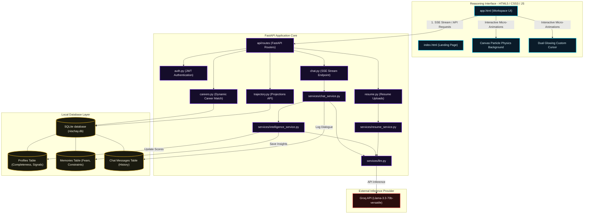

# Nischay — Premium AI Career & Life Reasoning Platform

Nischay is a state-of-the-art career coaching and cognitive reasoning platform that combines a beautiful, high-fidelity dark-void user interface with a real-time FastAPI intelligence engine powered by LLMs (Groq Llama-3.3).

---

## 🏗️ System Architecture Flowchart

Below is the complete system flow map demonstrating how the interactive HTML5/CSS3 frontend communicates with our FastAPI endpoints, security layers, background intelligence thread, SQLite database, and the LLM inference provider:



---

## ✨ Features

### 1. **High-Fidelity Visual Aesthetics**
- **Fractal Noise Overlay**: Subtle SVG-driven texture grain giving panels a physical, premium feel.
- **Dual Glowing Cursor**: Physics-based trailing custom cursor with glowing amber-gold accents. It automatically expands when hovering over interactive nodes and hides the standard OS pointer globally.
- **Floating Particles Background**: Interactive HTML5 canvas animating gold nodes and dynamic connection lines that shift according to distances.

### 2. **Cognitive Profile & Sidebar**
- **Profile Completeness**: Measures progress (0-100%) dynamically based on data points captured during dialogue.
- **Personality Signals**: Live progress tracking representing Risk Tolerance, Intrinsic Motivation, Analytical Style, and Conscientiousness.
- **Real-Time Behavioral Drift Alert**: Continuously maps contradiction scores from user memory logs to trigger contextual warnings:
  - **✔ Stable**: Perfect cognitive alignment in conversation.
  - **⚡ Low Drift**: Minor inconsistencies identified.
  - **⚠ Drift Detected** (Red glows): Significant tension between goals and underlying constraints.

### 3. **Intelligence Dashboard & Trajectories**
- **Dynamic Matching**: Recommends premium career categories (B.Tech CSE, Product Management, Design B.Des, B.Com + CA) using live cognitive math.
- **10-Year outlook projections**: Interactive coordinates plotting Income, Autonomy, Burnout, and Satisfaction over a decade.

### 4. **AI-Powered Resume Analysis**
- Upload PDF resumes to fetch direct, structured feedback detailing high, medium, and low priority improvements based on modern tech requirements.

---

## 🛠️ Tech Stack
- **Frontend**: Single-page Architecture (`app.html`), Vanilla JavaScript, Vanilla CSS variables.
- **Backend**: FastAPI, Async ASGI framework.
- **Database**: SQLite3 with dedicated schemas for thread memory and psychological profiles.
- **Model Integration**: Groq SDK leveraging high-performance `llama-3.3-70b-versatile`.
- **Text Extraction**: `PyPDF2` stream reader.

---

## 🚀 Getting Started

### 1. Prerequisites
- Python 3.10+
- A valid **Groq API Key** (Get one at [console.groq.com](https://console.groq.com/))

### 2. Setup Configuration
Create a `.env` file in the root directory:
```env
SECRET_KEY="your-cryptographically-random-secret-key"
GROQ_API_KEY="gsk_..."
LLM_MODEL="llama-3.3-70b-versatile"
DATABASE_URL="sqlite:///./nischay.db"
```

### 3. Installation
1. Install Python dependencies:
   ```bash
   pip install -r requirements.txt
   ```
2. Start the FastAPI local server:
   ```bash
   uvicorn main:app --reload --port 8000
   ```
3. Open your browser and navigate to the application:
   ```
   http://localhost:8000/
   ```

---

## 🔒 Security
- Stored password hashing uses high-performance cryptographic standards.
- REST API queries require a JWT token passed via `Authorization` header bearer verification.
- Sensitive environment databases (`.env`, `*.db`, local `venv/` directories) are securely locked down inside `.gitignore` preventing any leakage to public repositories.
